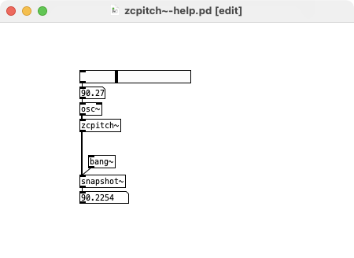

# pd-zcpitch_tilde
Simple zero-crossing based pitch tracker abstraction for Pd (Pure Data)

... obviously, this is a very basic technique for monophonic pitch detection and input signals may require some filtering for good results.

